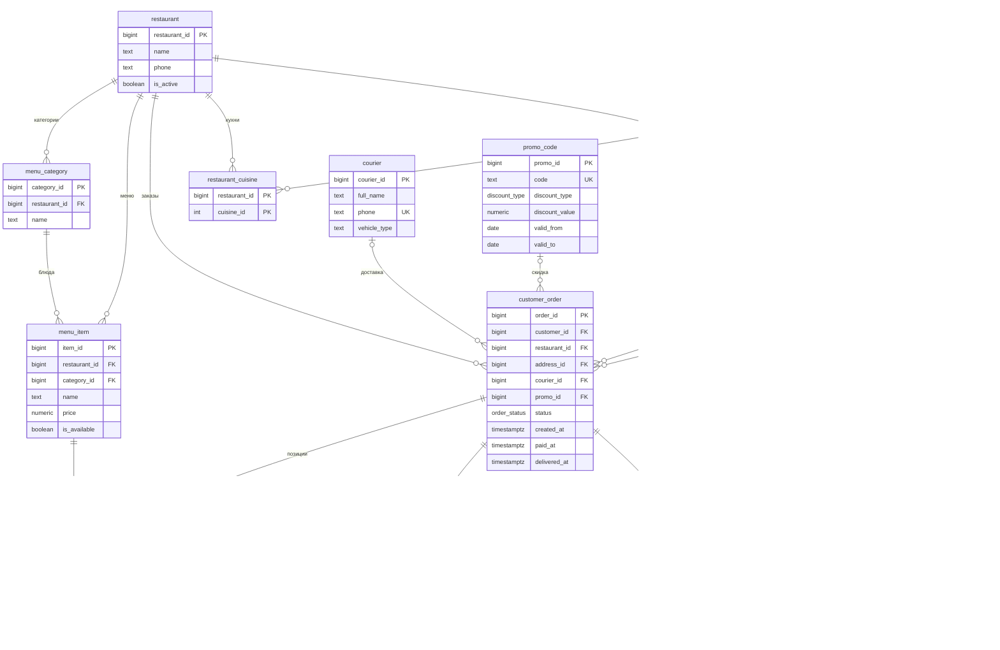

# Платформа доставки еды «Перекус» — проектирование реляционной БД

**Курс:** Конструирование баз данных
**Формат:** групповой проект, 4 участника
**Домен:** доставка еды, маркетплейс ресторанов
**Дата финальной сборки:** 12 июня 2026

---

## 1. Титульный лист

**Название проекта:** реляционная база данных платформы доставки еды «Перекус».

**Состав и роли команды:**

| Участник | Роль в проекте | Зона ответственности |
|---|---|---|
| Участник 1 | Архитектор схемы | ER-модель, DDL, ограничения целостности |
| Участник 2 | Аналитик нормализации | зависимости, нормальные формы, анализ аномалий |
| Участник 3 | SQL-разработчик | DML-запросы, транзакции, тестовые данные |
| Участник 4 | AI-координатор и редактор | AI-приложение, спорные решения, финальная сборка |

Фактические ФИО участников подставляются командой при сдаче в учебную систему; техническое и аналитическое содержание документа финализировано.

---

## 2. Описание предметной области

**«Перекус»** — платформа-маркетплейс, соединяющая клиентов, рестораны и курьеров: клиент выбирает блюда из меню ресторанов, оформляет и оплачивает заказ, курьер доставляет его по адресу клиента.

**Кому нужна и кто пользуется:**
- **Клиент** — ищет рестораны, собирает заказ, платит, отслеживает статус, смотрит историю.
- **Ресторан** (менеджер) — ведёт меню и цены, видит входящие заказы и аналитику продаж.
- **Курьер** — получает назначенные заказы, отмечает забор и доставку.
- **Оператор платформы** — следит за заказами, курьерами, метриками сервиса.

**Ключевые пользовательские сценарии:**
1. Клиент оформляет и оплачивает заказ из одного ресторана → заказ уходит в готовку → назначается курьер → доставка.
2. Ресторан меняет цену/доступность блюда; цены в уже оформленных заказах не меняются.
3. Клиент отменяет заказ до определённого статуса; при оплаченном — возврат.
4. Ресторан/оператор смотрит аналитику: топ блюд, выручка, среднее время доставки.

Граница проекта: система моделирует именно БД-часть маркетплейса. Внешние интеграции с банками, геокодированием, мобильными push-уведомлениями и реальной маршрутизацией курьеров не моделируются; в БД фиксируются только сущности и события, нужные для заказов, меню, оплаты, доставки, отзывов и аналитики.

---

## 3. Функциональные требования

| № | Требование | Тип операций |
|---|---|---|
| ФТ-1 | Регистрация клиента и управление его адресами доставки | C/R/U/D |
| ФТ-2 | Просмотр ресторанов и их меню по категориям (только доступные блюда) | R |
| ФТ-3 | Формирование заказа из блюд **одного** ресторана | C |
| ФТ-4 | Расчёт суммы заказа по ценам на момент оформления, с учётом промокода | R |
| ФТ-5 | Оплата заказа (карта / наличные / СБП) | C/U |
| ФТ-6 | Назначение курьера и смена статуса заказа | U |
| ФТ-7 | Отмена заказа с возвратом оплаты (если оплачен) | U |
| ФТ-8 | История заказов клиента | R |
| ФТ-9 | Управление меню рестораном (добавить/изменить/снять блюдо, изменить цену) | C/R/U/D |
| ФТ-10 | Аналитика ресторана: топ блюд, выручка по дням | R (сложн.) |
| ФТ-11 | Аналитика платформы: активные курьеры, среднее время доставки, доля отмен | R (сложн.) |
| ФТ-12 | Оценка заказа клиентом (рейтинг ресторана/курьера) | C/R |

---

## 4. Нефункциональные требования

**Производительность.** Базовые `JOIN`-ы и фильтры опираются на индексы из `schema.sql`: по внешним ключам `customer_order(customer_id / restaurant_id / courier_id)`, по `order_item(item_id)`, по `menu_item(restaurant_id, category_id)`, по адресу клиента `address(customer_id)`; история и аналитика по датам — по `customer_order(created_at)`, отчёты по статусам и оплатам — по `customer_order(status, restaurant_id)` и `payment(status, paid_at)`. При росте объёмов под тяжёлые отчёты рекомендуются материализованные представления с `REFRESH` по расписанию. Узкие места выявляются через `EXPLAIN ANALYZE` (B-Tree vs Seq Scan).

**Многопользовательский доступ и конкуренция.** Критична гонка при назначении курьера: два оператора не должны назначить разных курьеров одному заказу. Решение — атомарный `UPDATE` со стражем (`… WHERE order_id = :id AND status IN ('paid','cooking') AND courier_id IS NULL`, Q6): первый выигрывает, второй меняет 0 строк. При строгой сериализации — `SELECT … FOR UPDATE` по заказу. Уровень изоляции по умолчанию `READ COMMITTED` достаточен.

**Согласованность данных.** Ссылочная целостность — внешними ключами; доменная — `CHECK`/`UNIQUE`/`enum` (раздел 6). Бизнес-инварианты («оплата = позиции − скидка», «нет оплаченных заказов без позиций») держит атомарность транзакции оформления (раздел 12).

**Журналирование / аудит.** Базовый аудит встроен метками `created_at`, `paid_at`, `delivered_at`. Полная история переходов статусов — опциональная таблица `order_status_log(order_id, status, changed_at, actor)` на триггере (вынесено в расширение, чтобы не усложнять ядро).

**Масштабирование.** Партиционирование `customer_order` и `payment` по дате (`created_at`), вынос аналитики на реплику для чтения, материализованные витрины под отчёты ресторанов/платформы.

**Сопровождаемость.** Единый источник правды — `schema.sql` (schema freeze, правит Роль 1); `enum`-типы и говорящие имена; переносимость скриптов (`SET client_encoding`); воспроизводимые данные (`seed.sql`).

---

## 5. Предварительная модель данных

Итоговая модель — **14 сущностей** (v4: добавлен декларативный контроль способа оплаты и CHECK-инварианты времени/статусов). Полный DDL: `schema.sql` (проверен на PostgreSQL 18.3/18.4). ER-диаграмма — ниже (Mermaid; рендерится прямо в GitHub). Для отчёта высокого разрешения — `schema.dbml` → dbdiagram.io → экспорт PNG/PDF.

### 5.1. Каталог сущностей

| Сущность | Назначение | Первичный ключ | Внешние ключи |
|---|---|---|---|
| `customer` | клиент | `customer_id` | — |
| `address` | адрес доставки клиента | `address_id` | `customer_id` |
| `restaurant` | ресторан-партнёр | `restaurant_id` | — |
| `cuisine` | справочник кухонь | `cuisine_id` | — |
| `restaurant_cuisine` | кухни ресторана (M:N) | `(restaurant_id, cuisine_id)` | `restaurant_id`, `cuisine_id` |
| `restaurant_payment_method` | принимаемые способы оплаты | `(restaurant_id, method)` | `restaurant_id` |
| `menu_category` | категория меню | `category_id` | `restaurant_id` |
| `menu_item` | блюдо | `item_id` | `restaurant_id`, `category_id` |
| `courier` | курьер | `courier_id` | — |
| `promo_code` | промокод | `promo_id` | — |
| `customer_order` | заказ | `order_id` | `customer_id`, `restaurant_id`, `address_id`, `courier_id?`, `promo_id?` |
| `order_item` | позиция заказа (M:N заказ↔блюдо) | `(order_id, item_id)` | →`customer_order(order_id,restaurant_id)`, →`menu_item(item_id,restaurant_id)` |
| `payment` | оплата заказа (1:1) | `payment_id` | `order_id` (UNIQUE), `restaurant_id`, `(restaurant_id, method)` |
| `order_review` | отзыв о выполненном заказе (0..1 к заказу) | `review_id` | `order_id` (UNIQUE) |

`?` — необязательный (NULLable) внешний ключ.

### 5.2. Связи и кардинальности
- `customer` 1—N `address`; `customer` 1—N `customer_order`
- `restaurant` 1—N `menu_category` 1—N `menu_item`
- `restaurant` N—M `cuisine` (через `restaurant_cuisine`); `restaurant` 1—N `restaurant_payment_method`
- `customer_order` 1—N `order_item` N—1 `menu_item` ⇒ заказ ↔ блюдо как **M:N**
- `customer_order` 1—(0..1) `payment`; `customer_order` 1—(0..1) `order_review`; `courier` 1—N `customer_order` (у заказа 0..1 курьер); `promo_code` 1—N `customer_order` (0..1 промокод)
- `address` 1—N `customer_order` (с v3 — составной FK: адрес принадлежит клиенту заказа)

### 5.3. ER-диаграмма



**Решение по статусам (закрыто):** жизненный цикл заказа храним одним полем `customer_order.status` (enum `order_status`). Отдельная таблица-лог `order_status_log` — необязательное расширение (НФТ, Роль 3), в базовую модель не входит.

---

## 6. Текстовые ограничения на данные

Ограничения предметной области (О1…О27). Для каждого указано, **как обеспечивается**: декларативно средствами БД (`UNIQUE`/`FK`/`CHECK`/`enum`/составной FK) или процедурно (приложение/транзакция/триггер).

**Уникальность и идентификация**
- **О1.** Телефон клиента уникален. — *`UNIQUE(customer.phone)`*
- **О2.** Телефон курьера уникален. — *`UNIQUE(courier.phone)`*
- **О3.** Код промокода уникален. — *`UNIQUE(promo_code.code)`*
- **О4.** Название кухни уникально. — *`UNIQUE(cuisine.name)`*
- **О5.** Имя категории уникально в пределах ресторана. — *`UNIQUE(menu_category.restaurant_id, name)`*

**Структура и кардинальности**
- **О6.** Каждый заказ относится ровно к одному клиенту и одному ресторану. — *`FK NOT NULL`*
- **О7.** У заказа ровно один адрес доставки. — *`FK address_id NOT NULL`*
- **О8.** У заказа 0..1 курьер и 0..1 промокод. — *`FK`, NULL разрешён*
- **О9.** На заказ — не более одной оплаты (связь 1:1). — *`UNIQUE(payment.order_id)`*
- **О10.** Блюдо принадлежит одному ресторану и одной категории; категория — одному ресторану. — *`FK NOT NULL`*
- **О11.** Заказ содержит ≥ 1 позицию (пустых заказов нет). — *приложение/транзакция оформления*

**Доменная целостность (межтабличная)**
- **О12.** Все позиции заказа ссылаются на блюда **того же** ресторана, что и заказ. — *составной FK (`decisions.md` №6)*
- **О13.** Адрес доставки заказа принадлежит клиенту этого заказа. — *составной FK `customer_order(address_id, customer_id) → address(address_id, customer_id)` (v3; простым FK не выразить, составным — да, см. `decisions.md` №8)*
- **О14.** Курьер назначается не раньше статуса `paid`/`cooking`. — *приложение (`dml.sql` Q6 — условие в `WHERE`)*
- **О15.** Блюдо добавляется в заказ, только если `is_available`. — *приложение (проверка при оформлении, T1)*

**Значения и согласованность сумм**
- **О16.** Количество в позиции > 0. — *`CHECK(quantity > 0)`*
- **О17.** Цены и суммы ≥ 0 (`price`, `unit_price`, `amount`, `discount_value`). — *`CHECK`*
- **О18.** `unit_price` фиксируется при оформлении и далее не меняется (снимок цены). — *транзакция T1; строки `order_item` не обновляются*
- **О19.** Сумма оплаты = Σ(`quantity` × `unit_price`) − скидка по промокоду. — *приложение (расчёт при оформлении)*
- **О20.** Промокод применим, только если сумма заказа ≥ `min_order_amount` и дата ∈ `[valid_from, valid_to]`. — *приложение*
- **О21.** `valid_to ≥ valid_from` у промокода. — *`CHECK`*

**Жизненный цикл и время**
- **О22.** Статусы заказа: `created → paid → cooking → on_the_way → delivered`; `cancelled` — из любого незавершённого. — *`enum order_status`, CHECK-инварианты в `customer_order`, стражи в Q6/T2*
- **О23.** `created_at ≤ paid_at ≤ delivered_at` (для заданных значений). — *`CHECK chk_order_time_flow`*

**Оплата и отзывы (дополнено v2–v4 по итогам аудита)**
- **О24.** Способ оплаты заказа входит в принимаемые рестораном этого заказа. — *составной FK `payment(restaurant_id, method) → restaurant_payment_method(restaurant_id, method)`*
- **О25.** На заказ — не более одного отзыва. — *`UNIQUE(order_review.order_id)`*
- **О26.** Отзыв оставляет клиент этого заказа и только после доставки (`status = 'delivered'`). — *приложение (Q13 — стражи в `WHERE`)*
- **О27.** Оценка ресторана обязательна, оценка курьера опциональна; обе — целые 1..5. — *`NOT NULL`/`CHECK`*

> Декларативно (БД) закрыты О1–О10, О12, О13, О16, О17, О21, О23–О25, О27; с v4 также зафиксированы базовые CHECK-инварианты статусов заказа и оплаты. Процедурно (приложение/транзакции) остаются О11, О14, О15, О18–О20, часть переходов О22 и О26: они зависят от последовательности действий пользователя и состояния связанных таблиц.

---

## 7. Зависимости

### 7.1. Функциональные зависимости и ключи по отношениям

| Отношение | Функциональные зависимости | Потенциальные ключи | НФ |
|---|---|---|---|
| `customer` | `customer_id →` остальные; `phone → customer_id` | `{customer_id}`, `{phone}` | BCNF |
| `address` | `address_id →` остальные | `{address_id}` | BCNF |
| `restaurant` | `restaurant_id →` остальные | `{restaurant_id}` | BCNF |
| `cuisine` | `cuisine_id → name`; `name → cuisine_id` | `{cuisine_id}`, `{name}` | BCNF |
| `restaurant_cuisine` | — (всё-ключевое) | `{restaurant_id, cuisine_id}` | 4НФ |
| `restaurant_payment_method` | — (всё-ключевое) | `{restaurant_id, method}` | 4НФ |
| `menu_category` | `category_id → restaurant_id, name`; `(restaurant_id, name) → category_id` | `{category_id}`, `{restaurant_id, name}` | BCNF |
| `menu_item` | `item_id →` остальные; `category_id → restaurant_id` | `{item_id}` | 3НФ \* |
| `courier` | `courier_id →` остальные; `phone → courier_id` | `{courier_id}`, `{phone}` | BCNF |
| `promo_code` | `promo_id →` остальные; `code → promo_id` | `{promo_id}`, `{code}` | BCNF |
| `customer_order` | `order_id →` остальные | `{order_id}` | BCNF |
| `order_item` | `(order_id, item_id) → quantity, unit_price`; `order_id → restaurant_id`; `item_id → restaurant_id` | `{(order_id, item_id)}` | 2НФ \* |
| `payment` | `payment_id →` остальные; `order_id → payment_id, restaurant_id, amount, method, status, paid_at` | `{payment_id}`, `{order_id}` | BCNF |
| `order_review` | `review_id →` остальные; `order_id → review_id` | `{review_id}`, `{order_id}` | BCNF |

\* **Контролируемая избыточность.** `menu_item` и `order_item` несут осознанно дублирующий `restaurant_id` (ради декларативного составного FK, `decisions.md` №6). Из-за него `menu_item` формально нарушает 3НФ/BCNF (`category_id → restaurant_id` — детерминант-не-ключ), а `order_item` — 2НФ (частичная `order_id → restaurant_id`). В «чистом» виде обе — BCNF: `menu_item(item_id → …)` без `restaurant_id`, `order_item((order_id, item_id) → quantity, unit_price)`. Значение всегда согласовано (`item → category → restaurant` = `order → restaurant`) — аномалий нет.

### 7.2. Многозначные зависимости (MVD) → основание для 4НФ
В предобъединённом профиле ресторана `(restaurant_id, cuisine_id, method)` факты «кухни» и «способы оплаты» **независимы**: `restaurant_id ↠ cuisine_id` и `restaurant_id ↠ method` — нетривиальные MVD, не сводящиеся к FD. Хранение в одной таблице даёт декартово произведение и аномалии ⇒ разнесено на `restaurant_cuisine` и `restaurant_payment_method` (4НФ, раздел 8).

### 7.3. Зависимости включения (внешние ключи)
Ссылочная целостность задаётся внешними ключами, в т.ч. составными: `address.customer_id ⊆ customer`, `menu_category.restaurant_id ⊆ restaurant`, `menu_item.restaurant_id ⊆ restaurant`, `menu_item.(category_id, restaurant_id) ⊆ menu_category(category_id, restaurant_id)`, `customer_order.{customer_id, restaurant_id, courier_id, promo_id} ⊆` соответствующие ключи, `customer_order.(address_id, customer_id) ⊆ address(address_id, customer_id)`, `order_item.(order_id, restaurant_id) ⊆ customer_order(order_id, restaurant_id)`, `order_item.(item_id, restaurant_id) ⊆ menu_item(item_id, restaurant_id)`, `payment.(order_id, restaurant_id) ⊆ customer_order(order_id, restaurant_id)`, `payment.(restaurant_id, method) ⊆ restaurant_payment_method(restaurant_id, method)`, `order_review.order_id ⊆ customer_order`, `restaurant_cuisine.{restaurant_id, cuisine_id} ⊆ {restaurant, cuisine}`, `restaurant_payment_method.restaurant_id ⊆ restaurant` (полный список — `schema.sql`).

### 7.4. Полнота и непротиворечивость
Замыкание приведённого множества FD покрывает все неключевые атрибуты каждого отношения (каждый детерминируется своим ключом); противоречий (двух значений у одного детерминанта) нет. Множество минимально — выводимые/транзитивные FD в каноническую схему не внесены, кроме осознанной избыточности `restaurant_id` (п. 7.1).

---

## 8. Нормализация

> Идея: берём «сырое» универсальное отношение `ЗАКАЗ` и доводим до итоговой схемы, на каждом шаге фиксируя устраняемую аномалию. Многозначные факты ресторана — отдельной веткой (4НФ). Перечень FD, ключей и НФ по отношениям — в разделе 7; конкретный пример аномалии со строками — в разделе 9.

**Исходное «сырое» отношение (UNF).** Одна строка = один заказ; позиции — повторяющаяся группа:

```
ЗАКАЗ( order_id;
       created_at, status, delivered_at;
       customer_id, customer_name, customer_phone, customer_email;
       deliv_city, deliv_street, deliv_building, deliv_apartment;
       restaurant_id, restaurant_name, restaurant_phone;
       courier_id, courier_name, courier_phone, vehicle_type;
       promo_code, discount_type, discount_value, min_order_amount;
       pay_method, pay_amount, pay_status, paid_at;
       { item_id, item_name, category_name, menu_price, quantity, unit_price }* )  ← повтор. группа
```

**Шаг 1 → 1НФ** (атомарные атрибуты, нет повторяющихся групп). Разворачиваем позиции — одна строка = одна позиция. Первичный ключ: `(order_id, item_id)`.
- _Устранено:_ неатомарный список позиций.  _Осталось:_ вся «шапка» заказа дублируется в каждой строке.

Действующие FD (сокращённо):
```
(order_id, item_id) → quantity, unit_price
order_id      → created_at, status, delivered_at, customer_id, restaurant_id,
                courier_id, promo_id, address(deliv_*), pay_*
customer_id   → customer_name, customer_phone, customer_email
restaurant_id → restaurant_name, restaurant_phone
courier_id    → courier_name, courier_phone, vehicle_type
item_id       → item_name, category_id, menu_price, is_available, restaurant_id
category_id   → category_name, restaurant_id
promo_id      → promo_code, discount_type, discount_value, min_order_amount
```

**Шаг 2 → 2НФ** (нет зависимостей от *части* составного ключа `(order_id, item_id)`).
- атрибуты, зависящие только от `order_id` → выносим в **ЗАКАЗ**(order_id, …шапка…);
- атрибуты, зависящие только от `item_id` → выносим в **БЛЮДО**(item_id, …);
- зависящие от полного ключа остаются: **ПОЗИЦИЯ**(order_id, item_id, quantity, unit_price).
- _Устранено:_ цена/название блюда больше не повторяются в каждом заказе (правка цены — в одном месте); данные заказа — не в каждой позиции.

**Шаг 3 → 3НФ** (нет транзитивных зависимостей «неключ → неключ»).
- В **ЗАКАЗ**: `order_id → customer_id → данные клиента` ⇒ **КЛИЕНТ**; аналогично `restaurant_id` ⇒ **РЕСТОРАН**, `courier_id` ⇒ **КУРЬЕР**, `promo_id` ⇒ **ПРОМОКОД**. Вводим суррогат `address_id`: `order_id → address_id → поля адреса` ⇒ **АДРЕС**(address_id, customer_id, …).
- В **БЛЮДО**: `item_id → category_id → category_name` ⇒ **КАТЕГОРИЯ**(category_id, restaurant_id, name).
- _Устранено:_ смена телефона ресторана/клиента — в одной строке; исчезают аномалии вставки/удаления «последнего заказа» (раздел 9).
- **ПЛАТЁЖ**(payment_id, order_id, amount, method, status, paid_at) выделен отдельно — это **не** требование 3НФ (поля оплаты зависят от `order_id` напрямую), а проектное решение (отдельная сущность; `order_id` — альтернативный ключ, связь 1:1). См. `decisions.md` №7.

**Шаг 4 → BCNF** (каждый детерминант — потенциальный ключ).
- **КАТЕГОРИЯ**: два потенциальных ключа — `category_id` и `(restaurant_id, name)`; оба ключи ⇒ BCNF.
- **ПЛАТЁЖ**: `payment_id` и `order_id` — оба ключи ⇒ BCNF.
- Остальные отношения имеют единственный ключ-детерминант ⇒ BCNF.
- ⚠️ **Осознанное исключение (контролируемая избыточность).** Колонка `restaurant_id` намеренно оставлена в `menu_item` **и** `order_item` ради декларативного составного FK «позиции — из ресторана заказа» (`decisions.md` №6). Из-за неё `menu_item` формально нарушает 3НФ/BCNF (`category_id → restaurant_id` — детерминант-не-ключ), а `order_item` — 2НФ (частичная `order_id → restaurant_id`). Значение всегда согласовано (`item → category → restaurant` = `order → restaurant`), поэтому аномалий нет; в «чистом» виде обе таблицы были бы в BCNF (см. раздел 7).

**Шаг 5 → 4НФ** (нет нетривиальных многозначных зависимостей).
Факты «кухни ресторана» и «принимаемые способы оплаты» **независимы**. В объединённом **РЕСТОРАН_ПРОФИЛЬ**(restaurant_id, cuisine, accepted_method) — всё-ключевое отношение (формально BCNF), но есть независимые MVD `restaurant_id ↠ cuisine` и `restaurant_id ↠ accepted_method`. Приходится хранить декартово произведение: у «Бургер Хаус» 2 кухни × 3 способа оплаты = **6 строк**; добавили способ оплаты — +2 строки.
- _Декомпозиция:_ **РЕСТОРАН_КУХНЯ**(restaurant_id, cuisine_id) и **РЕСТОРАН_ОПЛАТА**(restaurant_id, method) + словарь **КУХНЯ**(cuisine_id, name). Каждое несёт одну MVD ⇒ 4НФ.

**Итоговая схема (= `schema.sql` v4), 14 отношений:**
`customer`, `address`, `restaurant`, `cuisine`, `restaurant_cuisine`, `restaurant_payment_method`, `menu_category`, `menu_item`, `courier`, `promo_code`, `customer_order`, `order_item`, `payment`, `order_review`.

> `order_review` выделен отдельной таблицей по тем же соображениям, что и `payment`: это самостоятельное опциональное событие (0..1 к заказу) со своим временем; поля в `customer_order` означали бы NULL у всех неоценённых заказов (см. `decisions.md` №9). Все атрибуты зависят от ключей `review_id`/`order_id` напрямую — BCNF.

> Примечание: `order_item.unit_price` — **не** нарушение нормализации. Это самостоятельный факт (цена на момент заказа ≠ текущая `menu_item.price`), см. раздел 9 и `decisions.md` №3.

---

## 9. Пример аномалии в ненормализованной схеме

Возьмём «сырую» плоскую таблицу — одна строка на позицию заказа, всё в одном месте:

`order_flat(order_id, customer_name, customer_phone, restaurant_name, restaurant_phone, item_name, item_price, quantity)`

Пример наполнения (две позиции заказа №1 и одна — заказа №7, оба в «Пицца Рома»):

| order_id | customer_name | customer_phone | restaurant_name | restaurant_phone | item_name | item_price | qty |
|---|---|---|---|---|---|---|---|
| 1 | Анна Иванова | +7-900-000-0001 | Пицца Рома | +7-495-100-1001 | Маргарита | 500.00 | 3 |
| 1 | Анна Иванова | +7-900-000-0001 | Пицца Рома | +7-495-100-1001 | Кола 0.5 | 120.00 | 1 |
| 7 | Борис Петров | +7-900-000-0002 | Пицца Рома | +7-495-100-1001 | Маргарита | 550.00 | 2 |

`restaurant_phone` зависит от ресторана, `customer_phone` — от клиента (`order_id → customer → phone`, транзитивно), `item_name` — от блюда, а не от строки. Отсюда три аномалии:

- **Обновления:** «Пицца Рома» сменила телефон → править нужно в **каждой** из строк 1–3 (и во всех прочих строках её заказов). Пропустили одну — в базе два разных телефона у одного ресторана.
- **Вставки:** новое блюдо или новый ресторан нельзя завести, **пока по ним нет заказа** — нет строки без `order_id` (а `order_id` — часть ключа).
- **Удаления:** удалили единственный заказ ресторана → вместе с ним **исчезли** его название и телефон (потеря справочных данных).

Виден и источник проблемы — избыточность: телефон ресторана в примере повторяется трижды.

**Как решает нормализация.** Раскладываем (раздел 8) на `customer`, `restaurant`, `menu_item`, `customer_order`, `order_item`: каждый факт хранится один раз, заказ ссылается на сущности по ключам. Телефон ресторана меняется в одной строке `restaurant`; новое блюдо/ресторан заводится независимо от заказов; удаление заказа не задевает справочные данные.

> **Тонкость про `item_price`.** В `order_flat` он смешивает **два** факта — текущую цену меню и цену в конкретном заказе. В нормализованной схеме они разделены: текущая — `menu_item.price`, историческая — `order_item.unit_price` (снимок). В примере «Маргарита» у заказа 1 идёт по 500, а у заказа 7 — уже по 550: это **не** избыточность, а разные факты (`decisions.md` №3).

---

## 10. SQL DDL

Полный DDL — `schema.sql` (применяется на PostgreSQL 18 без ошибок; порядок: `schema.sql` → `seed.sql`). Ключевые решения реализации:

- **Суррогатные ключи** `BIGSERIAL`/`SERIAL` у всех основных сущностей — стабильны и не зависят от бизнес-данных; естественные ключи (`phone`, `cuisine.name`, `promo_code.code`) закреплены как `UNIQUE` (альтернативные ключи).
- **Перечислимые типы** (`order_status`, `payment_method`, `payment_status`, `discount_type`) вместо строк — контроль допустимых значений на уровне БД.
- **Целостность по внешним ключам:**
  - `address` и меню каскадно удаляются с владельцем (`ON DELETE CASCADE` от `customer`/`restaurant`);
  - `customer_order` ссылается на `customer`/`restaurant`/`address` с поведением по умолчанию `RESTRICT` — клиента/ресторан с заказами нельзя стереть;
  - `courier_id`, `promo_id` — NULLable (заказ без курьера/промокода допустим);
  - отзыв (`order_review`) каскадно удаляется с заказом.
- **Декларативное ограничение «позиции — из ресторана заказа»** (ограничение №2 из раздела 6): в `order_item` добавлена колонка `restaurant_id`, целостность держат **два составных FK** — на `customer_order(order_id, restaurant_id)` и `menu_item(item_id, restaurant_id)`; для этого на обеих таблицах заведены составные `UNIQUE`. Без триггеров (см. `decisions.md` №6).
- **Декларативное ограничение «категория блюда — из того же ресторана»** (v2, по итогам аудита 2026-06-10): составной FK `menu_item(category_id, restaurant_id) → menu_category(category_id, restaurant_id)`. Без него блюдо могло ссылаться на категорию **чужого** ресторана (подтверждено негативным тестом), что ломало инвариант `item → category → restaurant`, на котором держится контролируемая избыточность `restaurant_id` (разделы 7–8).
- **Декларативное ограничение «адрес доставки — клиента заказа»** (v3, О13): составной FK `customer_order(address_id, customer_id) → address(address_id, customer_id)`; колонка `customer_id` в заказе уже была, цена решения — один составной `UNIQUE` на `address`. Тот же приём, что и выше (см. `decisions.md` №8).
- **Декларативное ограничение «способ оплаты принимается рестораном»** (v4, О24): в `payment` добавлена колонка `restaurant_id`; целостность держат два составных FK — `payment(order_id, restaurant_id) → customer_order(order_id, restaurant_id)` и `payment(restaurant_id, method) → restaurant_payment_method(restaurant_id, method)`.
- **Снимок цены:** `order_item.unit_price` фиксирует цену на момент заказа (см. раздел 9, `decisions.md` №3).
- **CHECK-ограничения:** `quantity > 0`, `price ≥ 0`, `amount ≥ 0`, `promo_code.valid_to ≥ valid_from`; percent-скидка промокода не превышает 100 (`discount_type <> 'percent' OR discount_value <= 100`); оценки в отзыве `BETWEEN 1 AND 5`; с v4 добавлены `chk_order_time_flow`, `chk_order_status_time`, `chk_order_courier_status`, `chk_payment_paid_at`.
- **Связь 1:1** заказ↔оплата — через `payment.order_id UNIQUE`; связь 0..1 заказ↔отзыв — через `order_review.order_id UNIQUE` (О25).
- **Индексы** под внешние ключи и аналитику: `customer_order(customer_id/restaurant_id/courier_id/created_at/status+restaurant_id)`, `order_item(item_id)`, `menu_item(restaurant_id, category_id)`, `address(customer_id)`, `payment(status, paid_at)`.
- **Переносимость:** первой строкой `SET client_encoding TO 'UTF8'` — защита от авто-WIN1252 на Windows.

> **Schema freeze:** `schema.sql` помечен как v4 (каноническая; v2 = первые правки аудита, v3 = О13 + `order_review`, v4 = декларативное О24 + CHECK-и времени/статусов). Дальнейшие изменения — только через Роль 1.

---

## 11. SQL DML

Все запросы реализованы в `dml.sql` и проверены на PostgreSQL 18.3/18.4 + `seed.sql`.

**CRUD-запросы (Q1–Q7, Q13)** — покрывают создание / чтение / изменение / удаление:

| № | Операция | Что делает | ФТ | Пользователь |
|---|---|---|---|---|
| Q1 | CREATE | регистрация клиента | ФТ-1 | клиент |
| Q2 | CREATE | добавить адрес доставки | ФТ-1 | клиент |
| Q3 | READ | меню ресторана по категориям (только доступные) | ФТ-2 | клиент |
| Q4 | READ | история заказов клиента: сумма позиций до скидки, фактическая оплата, статус | ФТ-8 | клиент |
| Q5 | UPDATE | изменить цену блюда (снимки в заказах не трогаются) | ФТ-9 | ресторан |
| Q6 | UPDATE | назначить курьера и сменить статус (страж по статусу) | ФТ-6 | оператор |
| Q7 | DELETE | удалить неиспользуемый адрес (защита `NOT EXISTS`) | ФТ-1 | клиент |
| Q13 | CREATE | оставить отзыв на доставленный заказ (стражи: свой заказ + `delivered`) | ФТ-12 | клиент |

**Сложные запросы (Q8–Q12, Q14)** — демонстрируют ценность схемы (`JOIN` / `GROUP BY` / подзапросы / агрегаты / оконные функции):

| № | Что делает | Ключевой приём | ФТ | Пользователь |
|---|---|---|---|---|
| Q8 | топ-5 блюд каждого ресторана (отменённые заказы исключены) | оконная `ROW_NUMBER() OVER (PARTITION BY …)` | ФТ-10 | ресторан |
| Q9 | выручка по дням с нарастающим итогом | оконная `SUM() OVER (ORDER BY day)` | ФТ-10 | ресторан/оператор |
| Q10 | среднее время доставки по курьерам | агрегаты + `JOIN`, `AVG(interval)` | ФТ-11 | оператор |
| Q11 | клиенты с тратами выше средней | подзапрос в `HAVING` | ФТ-11 | маркетинг |
| Q12 | доля отменённых заказов по ресторанам | условная агрегация `COUNT(*) FILTER` + `GROUP BY` | ФТ-11 | оператор |
| Q14 | средний рейтинг ресторанов по отзывам | `AVG` + `JOIN` + `GROUP BY` | ФТ-12/ФТ-11 | клиент/оператор |

Проверенные выводы на `seed.sql`: Q8 — лидеры продаж: «Маргарита» 5 шт. («Пицца Рома»), «Калифорния» и «Филадельфия» по 3 («Суши Кит»), «Картошка фри» и «Чизбургер» по 3 («Бургер Хаус»); позиции отменённого заказа №8 не считаются — поэтому «Унаги маки» в топ не входит; Q9 — нарастающий итог 3540 → 6279 → 8229 → 9979 → 11379; Q11 — Борис 3670, Геннадий 3140, Анна 2620; Q12 — «Суши Кит» 33.3 %, остальные 0 %; Q13 — отзыв на недоставленный заказ даёт `INSERT 0 0` (страж О26), дубль отзыва бьётся об `UNIQUE` (О25); Q14 — «Суши Кит» 5.00 (1 отзыв), «Пицца Рома» 4.50 (2), «Бургер Хаус» 3.50 (2). T1 с промокодом `WELCOME200` на заказ 1220.00 создаёт оплату 1020.00; прямой `payment` с методом, который ресторан не принимает, отвергается FK. Полные тексты с пояснениями «ФТ / кто / зачем» — в `dml.sql`.

---

## 12. Описание транзакций

Атомарными делаем операции, меняющие несколько связанных таблиц, где частичное выполнение оставит данные несогласованными. Выделены две (код — `dml.sql`, часть C).

**T1 — Оформление и оплата заказа.** Объединяет: создание `customer_order` → вставку `order_item` со **снимком** текущих цен → проверку, что вставились все запрошенные позиции → проверку и расчёт промокода → создание `payment` → перевод заказа в `paid`. С v4 **О24** дополнительно защищено составным FK в `payment`: даже запись в обход T1 не сможет выбрать метод оплаты, который ресторан не принимает.
- *Границы:* от создания заказа до фиксации оплаты — единый бизнес-акт «оформить и оплатить».
- *Без транзакции:* деньги списаны, а заказа нет; заказ без позиций; часть недоступных позиций silently пропала; промокод применён к неподходящей сумме; сумма посчитана по ценам, успевшим измениться между шагами.
- *Проверено (PG 18.3/18.4):* T1 создаёт заказ (`paid`, сумма по снимку цен и скидке), последовательности продолжаются корректно; T1 с недопустимым способом оплаты или некорректным промокодом откатывается целиком.

**T2 — Отмена оплаченного заказа с возвратом.** Объединяет смену статуса на `cancelled` и пометку `payment` как `refunded`.
- *Без транзакции:* статус «отменён», но деньги не возвращены (или наоборот) — рассогласование «заказ ↔ оплата».

**Назначение курьера — вне T1 (решено).** Курьер появляется позже оплаты, поэтому это отдельный шаг (Q6), а не часть оформления. Его конкурентная безопасность держится не на длинной транзакции, а на атомарном `UPDATE` со стражем по статусу / `courier_id IS NULL` (раздел 4); включать его в T1 значило бы держать транзакцию открытой в ожидании свободного курьера.

*Уровень изоляции:* `READ COMMITTED` (по умолчанию) достаточен — T1 работает со своими новыми строками, конкуренция за общие строки минимальна.

---

## 13. Репрезентативные фрагменты работы с основной AI-моделью

Ниже приведены не полные логи переписки, а репрезентативные фрагменты, где AI использовался как инструмент анализа и проверки. Полный рабочий журнал команды хранится в `ai_log.md`.

### Фрагмент 1 — выбор границ предметной области

**Запрос команды:**
> Мы делаем учебный проект по проектированию реляционной БД. Сравни варианты: доставка еды как маркетплейс, система одного ресторана, каршеринг, учебные курсы. Нас интересуют M:N-связи, нормализация, транзакции и сложные SQL-запросы.

**Ответ модели (суть):**
> Маркетплейс доставки еды даёт богатую модель: клиенты, адреса, рестораны, меню, позиции заказа, курьеры, промокоды, оплаты. Есть естественная транзакция оформления заказа, M:N через позиции заказа и кухни ресторана, аналитика по продажам и курьерам. Система одного ресторана проще, но беднее по связям.

**Уточняющий запрос команды:**
> Не станет ли маркетплейс слишком сложным для учебного проекта? Какие границы нужно зафиксировать, чтобы не уйти в курьерскую геолокацию и внешние платежи?

**Комментарий команды:**
AI помог выбрать домен, но команда сузила границы: не моделируем банковский процессинг, маршрутизацию и push-уведомления; в БД фиксируем только данные, нужные для заказов, меню, оплаты, доставки, отзывов и аналитики.

### Фрагмент 2 — проверка зависимостей и нормализации

**Запрос команды:**
> Проверь предварительную схему доставки еды на функциональные и многозначные зависимости. Где есть риск нарушения 3НФ/BCNF/4НФ?

**Ответ модели (суть):**
> Ресторан имеет независимые наборы кухонь и способов оплаты: в одной таблице `(restaurant_id, cuisine, method)` возникнет декартово произведение и MVD. Позиция заказа должна хранить `unit_price` как цену на момент заказа, но это не то же самое, что текущая `menu_item.price`. Для проверки “позиции из ресторана заказа” можно выбрать либо триггер, либо составные FK с дополнительным `restaurant_id`.

**Уточняющий запрос команды:**
> `unit_price` выглядит как дублирование цены. Почему это не нарушение нормализации? И не слишком ли грубо добавлять `restaurant_id` в `order_item`?

**Комментарий команды:**
Полезным оказалось разделение “текущей цены меню” и “исторической цены заказа”: это разные факты, поэтому снимок цены оставлен. По `order_item.restaurant_id` команда признала контролируемую избыточность: формально есть отклонение от чистой НФ, но оно покупает декларативную целостность без триггеров.

### Фрагмент 3 — аудит DDL/DML негативными тестами

**Запрос команды:**
> Проведи критический аудит `schema.sql`, `seed.sql`, `dml.sql` и итогового документа. Не ограничивайся чтением: найди дыры целостности и расхождения между документом и кодом.

**Ответ модели (суть):**
> Найдены подтверждаемые проблемы: блюдо могло ссылаться на категорию чужого ресторана; заказ мог использовать адрес чужого клиента; percent-промокод мог быть больше 100; Q8 считал продажи отменённого заказа; T2 отменял уже доставленный заказ; ФТ-12 не была покрыта таблицей отзывов.

**Уточняющий запрос команды:**
> Какие из этих проблем можно закрыть декларативно средствами БД, а что оставить в транзакциях/приложении?

**Комментарий команды:**
После этого были добавлены составные FK для категории блюда и адреса заказа, CHECK для percent-скидки, `order_review`, фильтр отменённых заказов в Q8 и стражи в Q6/T2. Метод негативных тестов стал основным способом проверки ограничений: некорректная вставка должна падать на уровне БД, если инвариант можно выразить декларативно.

### Фрагмент 4 — финальная синхронизация v4

**Запрос команды:**
> Проверь финальную сборку: документ говорит, что О24 и CHECK-и времени закрыты в v4. Найди, где код не соответствует тексту.

**Ответ модели (суть):**
> В шапке `schema.sql` заявлены `payment.restaurant_id`, составные FK для способа оплаты и CHECK-и времени/статусов, но в фактической таблице `payment` этих полей и ограничений нет. T1 проверяет способ оплаты только процедурно и не считает промокод полностью. Документ содержит красные заглушки AI-разделов.

**Уточняющий запрос команды:**
> Реализуй v4, а не удаляй обещания. Сделай так, чтобы прямой `INSERT INTO payment` с неподдерживаемым методом оплаты отвергался БД.

**Комментарий команды:**
Итоговая правка: в `payment` добавлен `restaurant_id`, два составных FK, CHECK `chk_payment_paid_at`; в `customer_order` добавлены CHECK-и времени/статуса; T1 теперь считает скидку по промокоду и откатывается, если вставились не все позиции.

---

## 14. Независимая верификация второй моделью

Перед финальной сборкой материалы проекта были проверены во втором критическом проходе в роли независимого рецензента БД. Рецензенту были переданы разделы 2–12, `schema.sql`, `seed.sql`, `dml.sql` и список спорных решений.

**Запрос второй модели:**
> Ты — старший архитектор баз данных с большим практическим опытом и критическим стилем рецензирования. Я даю тебе описание предметной области, логическую модель данных, DDL-скрипт и набор SQL-запросов. Найди не менее 3 потенциальных проблем, спорных решений или слабых мест. Обрати внимание на скрытые аномалии, зависимости, нормализацию, производительность, ограничения целостности и SQL-решения. Для каждого замечания укажи проблему, где она проявится и какой вариант рассмотреть.

**Замечание Z1 — О24 было только процедурным.**
Проблема: `restaurant_payment_method` задаёт, какие методы оплаты принимает ресторан, но старая `payment(order_id, method)` не мешала прямой вставке оплаты неподдерживаемым методом.
Решение команды: принято. В v4 добавлен `payment.restaurant_id`; два составных FK связывают оплату с рестораном заказа и методом оплаты ресторана.

**Замечание Z2 — T1 могла оформить частичный заказ.**
Проблема: если пользователь передал две позиции, а одна недоступна или из другого ресторана, старая вставка могла добавить только одну позицию и оплатить частичный заказ.
Решение команды: принято. В T1 добавлена временная таблица запрошенных позиций и проверка `inserted_cnt = requested_cnt`; при нарушении `payment.amount` становится `NULL`, что откатывает транзакцию по `NOT NULL`.

**Замечание Z3 — промокод описан в требованиях, но не реализован в T1.**
Проблема: ФТ-4 требовало расчёт суммы с учётом промокода, а старая транзакция считала только сумму позиций.
Решение команды: принято. T1 теперь принимает `promo_id`, проверяет срок действия и `min_order_amount`, считает fixed/percent-скидку и ограничивает скидку суммой заказа.

**Замечание Z4 — временные инварианты лучше выразить CHECK-ами.**
Проблема: `created_at ≤ paid_at ≤ delivered_at`, наличие `paid_at` у оплаченных статусов и наличие `delivered_at` у `delivered` были описаны, но не закреплены в DDL.
Решение команды: принято частично декларативно. Добавлены `chk_order_time_flow`, `chk_order_status_time`, `chk_order_courier_status`, `chk_payment_paid_at`. Полный граф переходов статусов всё равно остаётся процедурным, потому что он зависит от предыдущего состояния строки.

**Замечание Z5 — документ был несинхронизирован с кодом.**
Проблема: `TODO.md` и `schema.dbml` ссылались на v3/открытые задачи, а итоговый документ содержал красные заглушки.
Решение команды: принято. Документ, DBML, TODO, решения и SQL-файлы синхронизированы под финальную v4.

**Замечание Z6 — `order_item.restaurant_id` и `payment.restaurant_id` являются контролируемой избыточностью.**
Проблема: эти поля можно считать отходом от “чистой” схемы, потому что ресторан выводится через заказ/блюдо.
Решение команды: оставить. Цена избыточности осознанна и компенсируется декларативной целостностью через составные FK; это вынесено в спорные решения.

---

## 15. Комментарий команды по работе с AI

**Что оказалось полезным.**
AI был наиболее полезен не как генератор схемы, а как критик: он предлагал негативные тесты, сверял обещания документа с DDL/DML и заставлял явно различать декларативные ограничения БД и процедурные правила приложения. Самые ценные изменения после AI-проверок: составные FK для ресторана позиции, адреса заказа и способа оплаты; CHECK-и времени/статусов; отдельная таблица `order_review`; исправление Q8, Q4, T1 и T2.

**Где AI был поверхностным или спорным.**
В ранних ответах модель иногда предлагала “чисто нормализовать” схему и убрать дублирующие `restaurant_id`, не учитывая, что без них нельзя просто выразить важные межтабличные ограничения через FK. Также предложение добавлять статусный лог было полезным как расширение, но избыточным для ядра учебного проекта; команда оставила его в НФТ как возможное развитие.

**Что изменили после проверки.**
Схема доведена до v4: `payment.restaurant_id`, составные FK для О24, CHECK-и времени/статуса заказа и оплаты, индексы `payment(status, paid_at)` и `customer_order(status, restaurant_id)`. DML обновлён: Q4 показывает фактическую оплату, T1 считает промокод и проверяет полноту позиций, Q8 исключает отменённые заказы, T2 не отменяет доставленные.

**Что сохранили вопреки возможной критике.**
Сохранены `order_item.restaurant_id` и `payment.restaurant_id` как контролируемая избыточность ради декларативных FK. Сохранена связь “один заказ — один ресторан”: мультиресторанный заказ реалистичен для некоторых маркетплейсов, но резко усложнил бы оплату, доставку и статусы без необходимости для учебной цели. Сохранена отдельная `payment`, хотя связь сейчас 1:1: это самостоятельное событие с жизненным циклом `pending/paid/refunded`.

---

## 16. Спорные проектные решения

### Решение 1 — маркетплейс, а не один ресторан

**Выбрано:** платформа с многими ресторанами, клиентами и курьерами.
**Альтернатива:** БД одного ресторана.
**Почему:** маркетплейс даёт связи M:N, справочники, оплату, доставку, аналитику и транзакции. Один ресторан проще, но слабее демонстрирует зависимости, 4НФ и сложные запросы.

### Решение 2 — один заказ относится к одному ресторану

**Выбрано:** `customer_order.restaurant_id` фиксирует ресторан заказа; все `order_item` должны ссылаться на блюда этого же ресторана.
**Альтернатива:** мультиресторанный заказ, где ресторан определяется на уровне позиции.
**Почему:** один ресторан на заказ соответствует обычной логистике доставки, упрощает оплату и назначение курьера. Мультиресторанность потребовала бы разбивать заказ на подзаказы, платежи и доставки.

### Решение 3 — снимок цены в `order_item.unit_price`

**Выбрано:** хранить цену блюда на момент оформления заказа.
**Альтернатива:** брать текущую цену из `menu_item.price`.
**Почему:** текущая цена меню и цена в уже оформленном заказе — разные факты. Без `unit_price` изменение меню исказило бы историю заказов, чеки и выручку. Это не ошибка нормализации, а фиксация исторического факта.

### Решение 4 — разнести кухни и способы оплаты ресторана

**Выбрано:** `restaurant_cuisine` и `restaurant_payment_method` как отдельные отношения.
**Альтернатива:** одна таблица профиля ресторана `(restaurant_id, cuisine_id, method)`.
**Почему:** кухни и способы оплаты независимы, значит в объединённой таблице возникнет многозначная зависимость и декартово произведение. Разнесение устраняет аномалии 4НФ.

### Решение 5 — составные FK вместо триггеров

**Выбрано:** для инвариантов “позиция из ресторана заказа”, “адрес принадлежит клиенту заказа”, “способ оплаты принимается рестораном” использовать дополнительные поля/UNIQUE и составные FK.
**Альтернатива:** триггеры или проверки только в приложении.
**Почему:** декларативные ограничения проще проверить, труднее обойти и легче объяснить в проекте БД. Цена — контролируемая избыточность `restaurant_id`, зафиксированная в разделах 7–8.

### Решение 6 — `payment` как отдельная сущность

**Выбрано:** отдельная таблица `payment` со статусом, суммой, методом и временем оплаты.
**Альтернатива:** поля оплаты прямо в `customer_order`.
**Почему:** оплата имеет собственный жизненный цикл (`pending → paid → refunded`), может развиваться до повторных попыток/частичных оплат, и её удобно защищать отдельными ограничениями. Один дополнительный JOIN для проекта несущественен.
