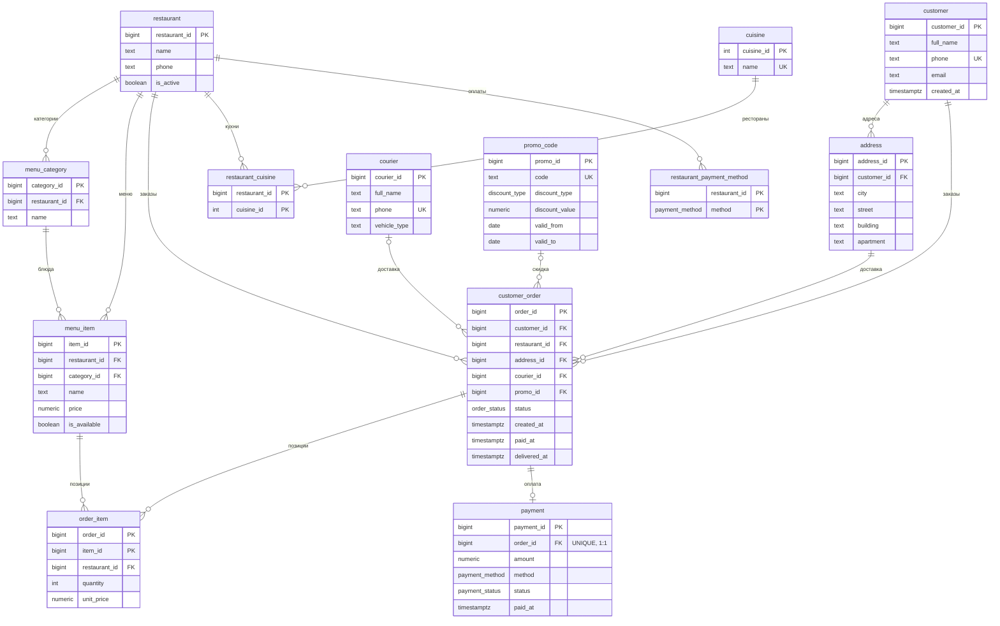

<!--
ИТОГОВЫЙ ДОКУМЕНТ ПРОЕКТА — единый источник правды.
Легенда статусов: 🔴 не начато · 🟡 черновик/в работе · 🟢 готово.   🟠 = открытый вопрос для команды.
Блоки «> ...» — подсказки/черновик. Правьте и дополняйте.
-->

# Платформа доставки еды «Перекус» — проектирование реляционной БД

**Команда:** <ФИО ×4>  ·  **Курс:** Конструирование баз данных  ·  **Домен:** доставка еды (маркетплейс)

> 🌱 **Статус: strawman-черновик для кикофа.** Цель — дать команде конкретику для критики, а не финальный текст. Что обсудить в первую очередь помечено 🟠.

---

## 1. Титульный лист 🔴
> Название, авторы и роли, курс, дата. Оформит Роль 4 в конце.

---

## 2. Описание предметной области 🟡 · _Роль 4_

**«Перекус»** — платформа-маркетплейс, соединяющая клиентов, рестораны и курьеров: клиент выбирает блюда из меню ресторанов, оформляет и оплачивает заказ, курьер доставляет его по адресу клиента.

**Кому нужна и кто пользуется:**
- **Клиент** — ищет рестораны, собирает заказ, платит, отслеживает статус, смотрит историю.
- **Ресторан** (менеджер) — ведёт меню и цены, видит входящие заказы и аналитику продаж.
- **Курьер** — получает назначенные заказы, отмечает забор и доставку.
- **Оператор платформы** — следит за заказами, курьерами, метриками сервиса.

**Ключевые пользовательские сценарии:**
1. Клиент оформляет и оплачивает заказ из одного ресторана → заказ уходит в готовку → назначается курьер → доставка.
2. Ресторан меняет цену/доступность блюда; цены в уже оформленных заказах не меняются.
3. Клиент отменяет заказ до определённого статуса; при оплаченном — возврат.
4. Ресторан/оператор смотрит аналитику: топ блюд, выручка, среднее время доставки.

🟠 **Решить на кикофе:** маркетплейс (много ресторанов) или система одного ресторана. Черновик — маркетплейс (богаче связи, см. `decisions.md` №1).

---

## 3. Функциональные требования 🟡 · _Роль 4_ · _рубрика №1 (0..1)_

| № | Требование | Тип операций |
|---|---|---|
| ФТ-1 | Регистрация клиента и управление его адресами доставки | C/R/U/D |
| ФТ-2 | Просмотр ресторанов и их меню по категориям (только доступные блюда) | R |
| ФТ-3 | Формирование заказа из блюд **одного** ресторана | C |
| ФТ-4 | Расчёт суммы заказа по ценам на момент оформления, с учётом промокода | R |
| ФТ-5 | Оплата заказа (карта / наличные / СБП) | C/U |
| ФТ-6 | Назначение курьера и смена статуса заказа | U |
| ФТ-7 | Отмена заказа с возвратом оплаты (если оплачен) | U |
| ФТ-8 | История заказов клиента | R |
| ФТ-9 | Управление меню рестораном (добавить/изменить/снять блюдо, изменить цену) | C/R/U/D |
| ФТ-10 | Аналитика ресторана: топ блюд, выручка по дням | R (сложн.) |
| ФТ-11 | Аналитика платформы: активные курьеры, среднее время доставки, доля отмен | R (сложн.) |
| ФТ-12 | Оценка заказа клиентом (рейтинг ресторана/курьера) | C/R |

---

## 4. Нефункциональные требования 🟡 · _Роль 3_ · _рубрика №7 (0..1, бонус)_
> Черновые тезисы — развить Роли 3:
- **Конкурентность:** одновременное назначение курьера на заказ не должно приводить к двойному назначению (блокировки/транзакции).
- **Согласованность:** сумма оплаты = сумма позиций − скидка; не должно быть оплаченных заказов без позиций.
- **Производительность:** аналитические запросы (топ блюд, выручка) на больших объёмах — поддержать индексами (есть опыт с B-Tree из семинара).
- **Журналирование:** история смен статуса заказа (опционально — таблица `order_status_log`).

---

## 5. Предварительная модель данных 🟢 · _Роль 1 — закрыто_ · _рубрика №2 (0..1)_

Итоговая модель — **13 сущностей**. Полный DDL: `schema.sql` (проверен на PostgreSQL 18). ER-диаграмма — ниже (Mermaid; рендерится прямо в GitHub). Для отчёта высокого разрешения — `schema.dbml` → dbdiagram.io → экспорт PNG/PDF.

### 5.1. Каталог сущностей

| Сущность | Назначение | Первичный ключ | Внешние ключи |
|---|---|---|---|
| `customer` | клиент | `customer_id` | — |
| `address` | адрес доставки клиента | `address_id` | `customer_id` |
| `restaurant` | ресторан-партнёр | `restaurant_id` | — |
| `cuisine` | справочник кухонь | `cuisine_id` | — |
| `restaurant_cuisine` | кухни ресторана (M:N) | `(restaurant_id, cuisine_id)` | `restaurant_id`, `cuisine_id` |
| `restaurant_payment_method` | принимаемые способы оплаты | `(restaurant_id, method)` | `restaurant_id` |
| `menu_category` | категория меню | `category_id` | `restaurant_id` |
| `menu_item` | блюдо | `item_id` | `restaurant_id`, `category_id` |
| `courier` | курьер | `courier_id` | — |
| `promo_code` | промокод | `promo_id` | — |
| `customer_order` | заказ | `order_id` | `customer_id`, `restaurant_id`, `address_id`, `courier_id?`, `promo_id?` |
| `order_item` | позиция заказа (M:N заказ↔блюдо) | `(order_id, item_id)` | →`customer_order(order_id,restaurant_id)`, →`menu_item(item_id,restaurant_id)` |
| `payment` | оплата заказа (1:1) | `payment_id` | `order_id` (UNIQUE) |

`?` — необязательный (NULLable) внешний ключ.

### 5.2. Связи и кардинальности
- `customer` 1—N `address`; `customer` 1—N `customer_order`
- `restaurant` 1—N `menu_category` 1—N `menu_item`
- `restaurant` N—M `cuisine` (через `restaurant_cuisine`); `restaurant` 1—N `restaurant_payment_method`
- `customer_order` 1—N `order_item` N—1 `menu_item` ⇒ заказ ↔ блюдо как **M:N**
- `customer_order` 1—(0..1) `payment`; `courier` 1—N `customer_order` (у заказа 0..1 курьер); `promo_code` 1—N `customer_order` (0..1 промокод)
- `address` 1—N `customer_order`

### 5.3. ER-диаграмма



**Решение по статусам (закрыто):** жизненный цикл заказа храним одним полем `customer_order.status` (enum `order_status`). Отдельная таблица-лог `order_status_log` — необязательное расширение (НФТ, Роль 3), в базовую модель не входит.

---

## 6. Текстовые ограничения на данные 🟡 · _Роль 2_

1. Каждый заказ относится ровно к одному клиенту и ровно к одному ресторану.
2. Все позиции заказа ссылаются на блюда **того же** ресторана, что и сам заказ.
3. У заказа ровно один адрес доставки, и этот адрес принадлежит клиенту заказа.
4. Цена позиции (`unit_price`) фиксируется в момент оформления и не меняется при последующем изменении цены в меню.
5. Курьер назначается заказу не раньше статуса «оплачен»/«готовится».
6. На один заказ приходится не более одной оплаты; сумма оплаты = сумма позиций − скидка по промокоду.
7. Промокод применим, только если сумма заказа ≥ `min_order_amount` и текущая дата в интервале `[valid_from, valid_to]`.
8. Блюдо можно добавить в заказ только если оно доступно (`is_available = true`).
9. Категория меню принадлежит одному ресторану; имя категории уникально в пределах ресторана.

🟠 Ограничение №2 нельзя выразить простым FK — нужен триггер **или** составной внешний ключ `(item_id, restaurant_id)`. См. `decisions.md` №6.

---

## 7. Зависимости 🟡 · _Роль 2_ · _рубрика №3 (0..2)_
> Стартовый набор — Роли 2 проверить на полноту и непротиворечивость.

**Функциональные зависимости (FD):**
- `customer_id → full_name, phone, email, created_at`
- `restaurant_id → name, phone, is_active`
- `category_id → restaurant_id, name`
- `item_id → restaurant_id, category_id, name, price, is_available`
- `order_id → customer_id, restaurant_id, address_id, courier_id, promo_id, status, created_at`
- `(order_id, item_id) → quantity, unit_price`
- `order_id → payment_id` и `payment_id → order_id, amount, method, status, paid_at`  (связь 1:1)
- `promo_id → code, discount_type, discount_value, valid_from, valid_to, min_order_amount`

**Многозначные зависимости (MVD) → основание для 4НФ:**
- В одном ресторане **независимо** сосуществуют: набор кухонь и набор принимаемых способов оплаты.
  `restaurant_id ↠ cuisine_id`  и  `restaurant_id ↠ payment_method`.
  Хранить их в одной таблице `(restaurant_id, cuisine, payment_method)` → ложные комбинации и аномалии ⇒ разносим в `restaurant_cuisine` и `restaurant_payment_method`.

---

## 8. Нормализация 🟡 · _Роль 2_ · _рубрика №4 (0..2)_

> Черновик строгого разбора — Роли 2 проверить и при желании дополнить примерами строк. Идея: берём «сырое» универсальное отношение `ЗАКАЗ` и доводим до итоговой схемы, на каждом шаге фиксируя устраняемую аномалию. Многозначные факты ресторана — отдельной веткой (4НФ).

**Исходное «сырое» отношение (UNF).** Одна строка = один заказ; позиции — повторяющаяся группа:

```
ЗАКАЗ( order_id;
       created_at, status, delivered_at;
       customer_id, customer_name, customer_phone, customer_email;
       deliv_city, deliv_street, deliv_building, deliv_apartment;
       restaurant_id, restaurant_name, restaurant_phone;
       courier_id, courier_name, courier_phone, vehicle_type;
       promo_code, discount_type, discount_value, min_order_amount;
       pay_method, pay_amount, pay_status, paid_at;
       { item_id, item_name, category_name, menu_price, quantity, unit_price }* )  ← повтор. группа
```

**Шаг 1 → 1НФ** (атомарные атрибуты, нет повторяющихся групп). Разворачиваем позиции — одна строка = одна позиция. Первичный ключ: `(order_id, item_id)`.
- _Устранено:_ неатомарный список позиций.  _Осталось:_ вся «шапка» заказа дублируется в каждой строке.

Действующие FD (сокращённо):
```
(order_id, item_id) → quantity, unit_price
order_id      → created_at, status, delivered_at, customer_id, restaurant_id,
                courier_id, promo_id, address(deliv_*), pay_*
customer_id   → customer_name, customer_phone, customer_email
restaurant_id → restaurant_name, restaurant_phone
courier_id    → courier_name, courier_phone, vehicle_type
item_id       → item_name, category_id, menu_price, is_available, restaurant_id
category_id   → category_name, restaurant_id
promo_id      → promo_code, discount_type, discount_value, min_order_amount
```

**Шаг 2 → 2НФ** (нет зависимостей от *части* составного ключа `(order_id, item_id)`).
- атрибуты, зависящие только от `order_id` → выносим в **ЗАКАЗ**(order_id, …шапка…);
- атрибуты, зависящие только от `item_id` → выносим в **БЛЮДО**(item_id, …);
- зависящие от полного ключа остаются: **ПОЗИЦИЯ**(order_id, item_id, quantity, unit_price).
- _Устранено:_ цена/название блюда больше не повторяются в каждом заказе (правка цены — в одном месте); данные заказа — не в каждой позиции.

**Шаг 3 → 3НФ** (нет транзитивных зависимостей «неключ → неключ»).
- В **ЗАКАЗ**: `order_id → customer_id → данные клиента` ⇒ **КЛИЕНТ**; аналогично `restaurant_id` ⇒ **РЕСТОРАН**, `courier_id` ⇒ **КУРЬЕР**, `promo_id` ⇒ **ПРОМОКОД**. Вводим суррогат `address_id`: `order_id → address_id → поля адреса` ⇒ **АДРЕС**(address_id, customer_id, …).
- В **БЛЮДО**: `item_id → category_id → category_name` ⇒ **КАТЕГОРИЯ**(category_id, restaurant_id, name).
- _Устранено:_ смена телефона ресторана/клиента — в одной строке; исчезают аномалии вставки/удаления «последнего заказа» (раздел 9).
- 🟠 **ПЛАТЁЖ**(payment_id, order_id, amount, method, status, paid_at) выделен отдельно — это **не** требование 3НФ (поля оплаты зависят от `order_id` напрямую), а проектное решение (отдельная сущность; `order_id` — альтернативный ключ, связь 1:1). См. `decisions.md` №7.

**Шаг 4 → BCNF** (каждый детерминант — потенциальный ключ).
- **КАТЕГОРИЯ**: два потенциальных ключа — `category_id` и `(restaurant_id, name)`; оба ключи ⇒ BCNF.
- **ПЛАТЁЖ**: `payment_id` и `order_id` — оба ключи ⇒ BCNF.
- Остальные отношения имеют единственный ключ-детерминант ⇒ BCNF.
- ⚠️ **Осознанное исключение:** в **БЛЮДО** оставлен `restaurant_id`, хотя `item_id → category_id → restaurant_id` (т.е. `category_id → restaurant_id` — детерминант, не являющийся ключом). Формальное нарушение 3НФ/BCNF, которое мы **сохраняем намеренно**: колонка нужна для декларативного составного FK «позиции — из ресторана заказа» (`decisions.md` №6). Значение всегда согласовано (`item → category → restaurant`), аномалии не возникают.

**Шаг 5 → 4НФ** (нет нетривиальных многозначных зависимостей).
Факты «кухни ресторана» и «принимаемые способы оплаты» **независимы**. В объединённом **РЕСТОРАН_ПРОФИЛЬ**(restaurant_id, cuisine, accepted_method) — всё-ключевое отношение (формально BCNF), но есть независимые MVD `restaurant_id ↠ cuisine` и `restaurant_id ↠ accepted_method`. Приходится хранить декартово произведение: у «Бургер Хаус» 2 кухни × 3 способа оплаты = **6 строк**; добавили способ оплаты — +2 строки.
- _Декомпозиция:_ **РЕСТОРАН_КУХНЯ**(restaurant_id, cuisine_id) и **РЕСТОРАН_ОПЛАТА**(restaurant_id, method) + словарь **КУХНЯ**(cuisine_id, name). Каждое несёт одну MVD ⇒ 4НФ.

**Итоговая схема (= `schema.sql`), 13 отношений:**
`customer`, `address`, `restaurant`, `cuisine`, `restaurant_cuisine`, `restaurant_payment_method`, `menu_category`, `menu_item`, `courier`, `promo_code`, `customer_order`, `order_item`, `payment`.

> Примечание: `order_item.unit_price` — **не** нарушение нормализации. Это самостоятельный факт (цена на момент заказа ≠ текущая `menu_item.price`), см. раздел 9 и `decisions.md` №3.

---

## 9. Пример аномалии в ненормализованной схеме 🟡 · _Роль 2_ · _рубрика №6 (0..1, бонус)_

«Сырая» плоская таблица — одна строка на позицию заказа:

`order_flat(order_id, created_at, customer_name, customer_phone, restaurant_name, restaurant_phone, item_name, item_price, quantity)`

Здесь `order_id → customer_phone` лишь **транзитивно** (`order → customer → phone`), а `item_name, item_price` зависят от блюда, а не от строки заказа. Отсюда:

- **Аномалия обновления:** ресторан сменил телефон → нужно править его во **всех** строках всех его заказов; пропустили одну — данные противоречивы.
- **Аномалия вставки:** новое блюдо нельзя завести в меню, пока его кто-нибудь не закажет (нет строки без заказа); новый ресторан некуда записать.
- **Аномалия удаления:** удалили единственный заказ ресторана → потеряли его название и телефон.

**Как решает нормализация:** выносим `customer`, `restaurant`, `menu_item` в отдельные таблицы; заказ хранит только ссылки. `unit_price` **сознательно** остаётся в `order_item` — это другой факт (цена на момент заказа ≠ текущая цена), а не нарушение нормализации (см. `decisions.md` №3).

---

## 10. SQL DDL 🟢 · _Роль 1 — закрыто_ · _рубрика №2_ → код в `schema.sql`

Полный DDL — `schema.sql` (применяется на PostgreSQL 18 без ошибок; порядок: `schema.sql` → `seed.sql`). Ключевые решения реализации:

- **Суррогатные ключи** `BIGSERIAL`/`SERIAL` у всех основных сущностей — стабильны и не зависят от бизнес-данных; естественные ключи (`phone`, `cuisine.name`, `promo_code.code`) закреплены как `UNIQUE` (альтернативные ключи).
- **Перечислимые типы** (`order_status`, `payment_method`, `payment_status`, `discount_type`) вместо строк — контроль допустимых значений на уровне БД.
- **Целостность по внешним ключам:**
  - `address` и меню каскадно удаляются с владельцем (`ON DELETE CASCADE` от `customer`/`restaurant`);
  - `customer_order` ссылается на `customer`/`restaurant`/`address` с поведением по умолчанию `RESTRICT` — клиента/ресторан с заказами нельзя стереть;
  - `courier_id`, `promo_id` — NULLable (заказ без курьера/промокода допустим).
- **Декларативное ограничение «позиции — из ресторана заказа»** (ограничение №2 из раздела 6): в `order_item` добавлена колонка `restaurant_id`, целостность держат **два составных FK** — на `customer_order(order_id, restaurant_id)` и `menu_item(item_id, restaurant_id)`; для этого на обеих таблицах заведены составные `UNIQUE`. Без триггеров (см. `decisions.md` №6).
- **Снимок цены:** `order_item.unit_price` фиксирует цену на момент заказа (см. раздел 9, `decisions.md` №3).
- **CHECK-ограничения:** `quantity > 0`, `price ≥ 0`, `amount ≥ 0`, `promo_code.valid_to ≥ valid_from`.
- **Связь 1:1** заказ↔оплата — через `payment.order_id UNIQUE`.
- **Индексы** под внешние ключи и аналитику: `customer_order(customer_id/restaurant_id/courier_id/created_at)`, `order_item(item_id)`, `menu_item(restaurant_id, category_id)`.
- **Переносимость:** первой строкой `SET client_encoding TO 'UTF8'` — защита от авто-WIN1252 на Windows.

> **Schema freeze:** `schema.sql` помечен как v1 (каноническая). Дальнейшие изменения — только через Роль 1.

---

## 11. SQL DML 🟡 · _Роль 3_ · _рубрика №5 (0..3)_ → код в `dml.sql`
> Готово в `dml.sql`: **7 запросов CRUD (Q1–Q7) + 5 сложных (Q8–Q12) + 2 транзакции**, все проверены на PG 18 + `seed.sql`. CRUD покрывают C/R/U/D и ФТ-1/2/6/8/9.

Сложные запросы Q8–Q12 (реализованы и проверены):
- **Топ-5 блюд каждого ресторана** по продажам — оконная `ROW_NUMBER() OVER (PARTITION BY restaurant_id ORDER BY SUM(qty) DESC)` (ФТ-10).
- **Выручка по дням с нарастающим итогом** — `SUM(...) OVER (ORDER BY day)` (ФТ-10).
- **Среднее время доставки по курьерам** — агрегаты + JOIN (ФТ-11).
- **Клиенты с суммой заказов выше средней** — подзапрос (ФТ-8/11).
- **Доля отменённых заказов по ресторанам** — условная агрегация + GROUP BY (ФТ-11).

---

## 12. Описание транзакций 🟡 · _Роль 3_

**Т1 — Оформление заказа (атомарно):** создать `customer_order` → вставить `order_item` со снимком цен → применить промокод и посчитать сумму → создать `payment`. Без транзакции возможны: деньги списаны, а заказ не создан; заказ без позиций; применён промокод к несуществующему заказу.

**Т2 — Отмена оплаченного заказа (атомарно):** сменить статус на `cancelled` → создать возврат/пометить `payment` как возвращённый. Без транзакции — статус «отменён», но деньги не возвращены.

🟠 Обсудить границы Т1: входит ли назначение курьера в ту же транзакцию или это отдельный шаг (черновик — отдельный, курьер назначается после оплаты).

---

## 13. Репрезентативные фрагменты работы с основной AI-моделью 🔴 · _Роль 4_ · _рубрика №8 (0..2)_
> 3–4 лучших фрагмента из `ai_log.md` (запрос → ответ → ваш критический уточняющий запрос + комментарий).

---

## 14. Независимая верификация второй моделью 🔴 · _Роль 4_ · _рубрика №9 (0..2)_
> Отдать материалы 2-й LLM в роли критика (каркас — задание §2.2). Сюда — её замечания.

---

## 15. Комментарий команды по работе с AI 🔴 · _Роль 4_
> Что было полезно; где AI ошибся; что изменили; что сохранили вопреки AI и почему.

---

## 16. Спорные проектные решения 🟡 · _Роль 4 из `decisions.md`_ · _рубрика №10 (0..2)_
> Черновик из 7 решений уже в `decisions.md` (маркетплейс vs один ресторан; заказ из одного ресторана; снимок цены; отдельная таблица адресов; 4НФ для кухонь/оплат; способ ограничения «позиции того же ресторана»; выделение `payment` в отдельную сущность). Выбрать ≥3 сильнейших и оформить.
